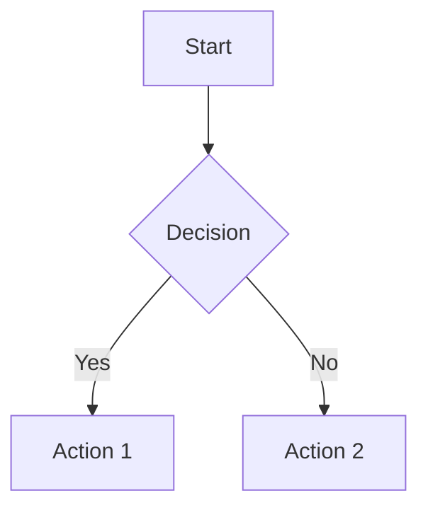
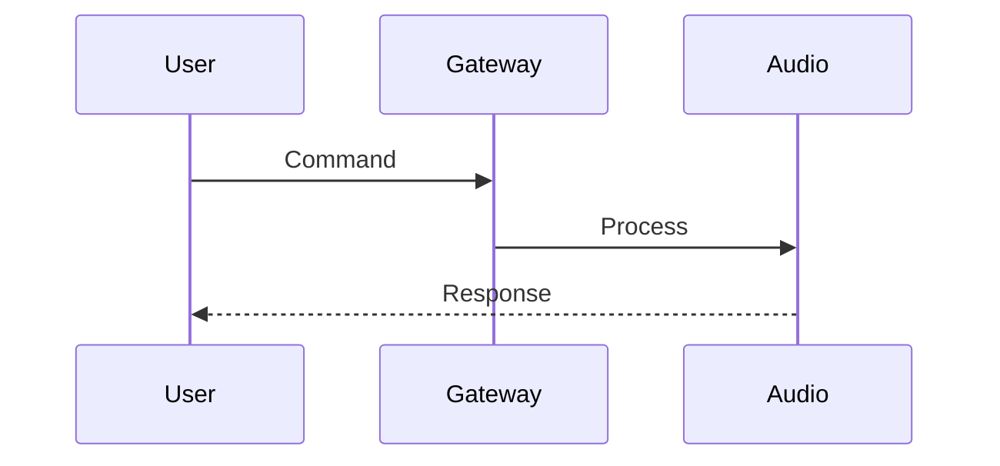
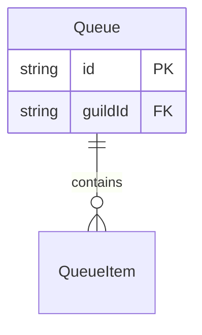
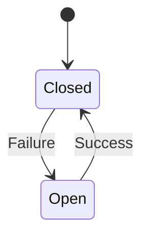
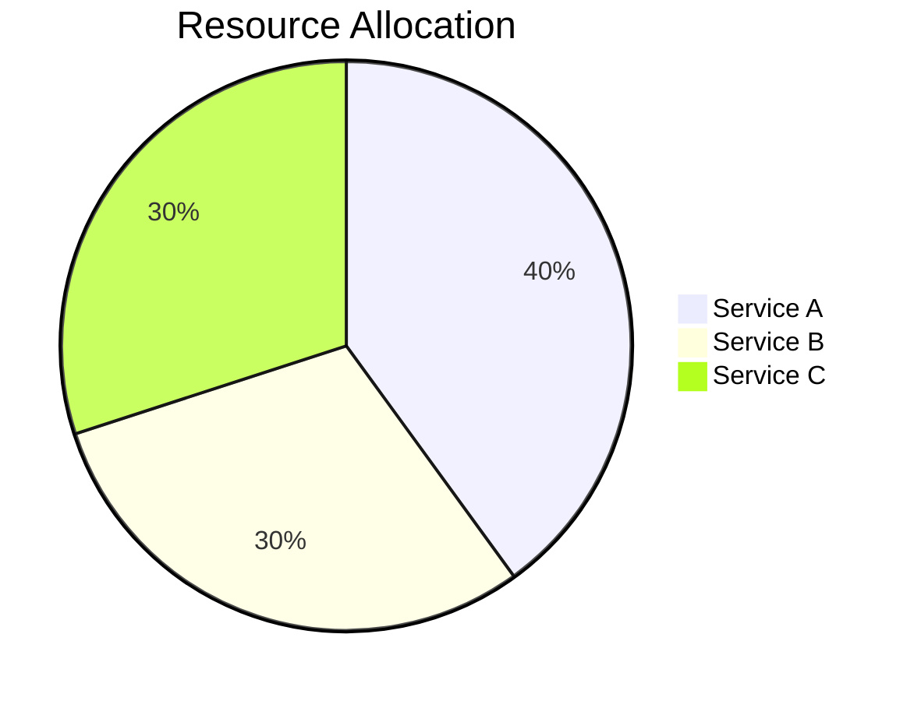

# Architecture Diagrams

This directory contains comprehensive Mermaid.js diagrams documenting the Discord bot's architecture, data flows, and error handling strategies.

## Available Diagrams

### 1. [Service Communication](./service-communication.md)
**Purpose:** Illustrates Redis pub/sub channels and inter-service communication patterns

**Key Topics:**
- Redis pub/sub channels (`discord-bot:commands`, `discord-bot:to-audio`, `discord-bot:to-discord`, `discord-bot:ui:now`)
- Gateway, Audio, API, and Worker service interactions
- Synchronous vs asynchronous communication patterns
- Critical voice connection fix (September 24, 2025)

**Best For:**
- Understanding how services communicate
- Debugging message flow issues
- Adding new pub/sub channels
- Onboarding new developers

---

### 2. [Database Schema](./database-schema.md)
**Purpose:** Complete PostgreSQL schema with all tables, relationships, and indexes

**Key Topics:**
- Entity relationship diagram with all Prisma models
- Queue and QueueItem management
- Premium features (ServerConfiguration, UserSubscription)
- Event sourcing tables (EventStoreEvent, EventStoreSnapshot)
- Configuration hierarchy (server → channel)
- Lyrics caching and playback history

**Best For:**
- Database migrations
- Understanding data relationships
- Query optimization
- Adding new models
- Premium feature development

---

### 3. [Deployment Architecture](./deployment-architecture.md)
**Purpose:** Docker container orchestration, networking, and resource allocation

**Key Topics:**
- Docker Compose service definitions
- Container dependencies and health checks
- Port mappings and network configuration
- Resource limits (CPU, memory)
- Volume management and persistence
- Service scaling considerations

**Best For:**
- DevOps and deployment
- Production troubleshooting
- Resource optimization
- Container orchestration
- Infrastructure planning

---

### 4. [Data Flow](./data-flow.md)
**Purpose:** End-to-end data flow from user interaction to audio playback

**Key Topics:**
- Complete command flow (`/play`, `/skip`, button interactions)
- Voice connection establishment (critical fix details)
- Autoplay recommendation engine
- Search and caching strategies
- UI update propagation
- Metrics collection

**Best For:**
- Understanding feature implementation
- Debugging playback issues
- Performance optimization
- Adding new commands
- UI/UX improvements

---

### 5. [Error Handling](./error-handling.md)
**Purpose:** Comprehensive error handling, retry logic, and resilience patterns

**Key Topics:**
- Error classification hierarchy (Discord, YouTube, Database, Network)
- Discord API error handling with fallback strategies
- YouTube/Lavalink error classification
- Circuit breaker pattern
- Retry strategies with exponential backoff
- Observability and monitoring

**Best For:**
- Improving error resilience
- Debugging error scenarios
- Implementing new error handlers
- Monitoring and alerting setup
- Understanding fallback strategies

---

## How to View Diagrams

### Option 1: GitHub (Recommended)
1. Navigate to any `.md` file in this directory on GitHub
2. Diagrams render automatically in the browser
3. Full Mermaid.js support with syntax highlighting

### Option 2: VS Code
1. Install the **Markdown Preview Mermaid Support** extension
   - Extension ID: `bierner.markdown-mermaid`
2. Open any diagram `.md` file
3. Press `Ctrl+Shift+V` (Windows/Linux) or `Cmd+Shift+V` (Mac) to open preview
4. Diagrams render in the preview pane

### Option 3: Mermaid Live Editor
1. Copy the Mermaid code block from any diagram
2. Visit https://mermaid.live/
3. Paste the code into the editor
4. Interactive editing and export options (PNG, SVG, PDF)

### Option 4: IntelliJ IDEA / WebStorm
1. Install the **Mermaid** plugin
2. Open any diagram `.md` file
3. Diagrams render in the built-in Markdown preview
4. Supports live editing and export

### Option 5: Obsidian
1. Open this repository in Obsidian
2. Diagrams render natively with Mermaid support
3. Graph view shows diagram interconnections

---

## Diagram Types Used

### 1. Flowchart / Graph (`graph TD`)
**Used in:** Service Communication, Error Handling
**Best for:** Process flows, decision trees, system architecture



### 2. Sequence Diagram (`sequenceDiagram`)
**Used in:** Data Flow, Error Handling
**Best for:** Time-based interactions, API calls, message flows



### 3. Entity Relationship Diagram (`erDiagram`)
**Used in:** Database Schema
**Best for:** Database relationships, data models



### 4. State Diagram (`stateDiagram-v2`)
**Used in:** Error Handling (Circuit Breaker)
**Best for:** State machines, lifecycle diagrams



### 5. Pie Chart (`pie`)
**Used in:** Deployment Architecture
**Best for:** Resource distribution, proportions



---

## Diagram Conventions

### Colors
- **Blue (#4dabf7)** - Application services (Gateway, API, Audio, Worker)
- **Purple (#845ef7)** - Database (PostgreSQL)
- **Red (#ff6b6b)** - Cache/Queue (Redis)
- **Yellow (#ffd43b)** - External services (Lavalink)
- **Green (#51cf66)** - Success states, retryable operations
- **Orange (#ff8787)** - Warning states, errors
- **Dark Purple (#7950f2)** - External APIs (Discord)

### Notation
- **Solid lines (→)** - Synchronous calls
- **Dashed lines (-.->)** - Asynchronous messages
- **Thick lines (==>)** - Primary data flow
- **[*]** - Start/end state
- **{Decision}** - Decision points
- **||--o{** - One-to-many relationship
- **}o--||** - Many-to-one relationship

---

## Updating Diagrams

### When to Update
- Architecture changes (new services, removed dependencies)
- Database schema changes (migrations)
- New error handling patterns
- Deployment configuration changes
- Communication channel additions

### How to Update
1. Edit the relevant `.md` file
2. Update the Mermaid code block
3. Test rendering using one of the viewing methods above
4. Update the diagram description and key topics
5. Commit with descriptive message: `docs: update [diagram-name] - [change description]`

### Testing Changes
```bash
# Preview locally with Mermaid CLI (optional)
npm install -g @mermaid-js/mermaid-cli
mmdc -i service-communication.md -o service-communication.png

# Or use VS Code extension for live preview
```

---

## Additional Resources

### Mermaid.js Documentation
- Official Docs: https://mermaid.js.org/
- Syntax Reference: https://mermaid.js.org/intro/syntax-reference.html
- Live Editor: https://mermaid.live/

### Architecture Documentation
- [ARCHITECTURE.md](../../ARCHITECTURE.md) - High-level architecture overview
- [DEVELOPMENT_GUIDE.md](../../DEVELOPMENT_GUIDE.md) - Development setup and patterns
- [DEPLOYMENT_GUIDE.md](../../DEPLOYMENT_GUIDE.md) - Production deployment guide
- [CLAUDE.md](../../../CLAUDE.md) - Claude Code project instructions

### Related Diagrams
- [Project Status](../../PROJECT_STATUS.md) - Current development status
- [Platform Blueprint](../../PLATFORM_BLUEPRINT.md) - Future architecture plans
- [Directory Structure](../../DIRECTORY_STRUCTURE.md) - Codebase organization

---

## Troubleshooting

### Diagrams Not Rendering
1. **GitHub:** Ensure file is `.md` and code blocks are marked as `mermaid`
2. **VS Code:** Install/update Markdown Preview Mermaid Support extension
3. **Syntax Errors:** Validate syntax at https://mermaid.live/
4. **Browser Cache:** Hard refresh (Ctrl+Shift+R or Cmd+Shift+R)

### Common Issues
- **Missing arrows:** Check arrow syntax (`-->`, `-.->`, `==>`)
- **Broken relationships:** Verify entity names match exactly
- **Color not applied:** Ensure style statements are outside subgraphs
- **Text overlap:** Adjust layout direction (`TD`, `LR`, `RL`, `BT`)

### Getting Help
- Check existing GitHub issues for similar problems
- Reference Mermaid.js documentation
- Ask in project Discord/Slack channel
- Create GitHub issue with diagram code and error message

---

## Contributing

### Diagram Guidelines
1. **Clarity over complexity** - Break large diagrams into smaller focused ones
2. **Consistent naming** - Use same service names as codebase
3. **Add descriptions** - Every diagram should have context and key topics
4. **Test rendering** - Verify in multiple viewers before committing
5. **Update README** - Document new diagrams in this file

### Style Guide
- Use consistent color scheme (see Diagram Conventions)
- Include legend/key for complex diagrams
- Add notes for critical information
- Keep line lengths under 100 characters for readability
- Use subgraphs to group related components

### Review Process
1. Create feature branch: `docs/diagram-[name]`
2. Add/update diagram file(s)
3. Update this README if adding new diagram
4. Test rendering in at least 2 viewers
5. Create PR with screenshots of rendered diagrams
6. Request review from architecture team

---

## Changelog

### 2025-10-31
- Initial creation of all 5 comprehensive diagrams
- Service Communication diagram with Redis pub/sub channels
- Database Schema with full Prisma model relationships
- Deployment Architecture with Docker configuration
- Data Flow with complete command-to-playback sequences
- Error Handling with retry logic and circuit breakers

---

## Questions?

For questions about these diagrams or the architecture they represent:
- Review related documentation in `/docs`
- Check inline code comments in relevant services
- Open a GitHub issue with `[docs]` tag
- Contact the architecture team

**Last Updated:** 2025-10-31
**Maintained By:** Architecture Team
**Diagram Count:** 5
