# Data Flow Architecture

## Overview
This diagram illustrates the complete data flow from user interaction to audio playback, including all intermediate processing steps, service communication, and UI updates.

## Complete User Command Flow

```mermaid
sequenceDiagram
    participant User
    participant Discord
    participant Gateway
    participant Redis
    participant Audio
    participant Lavalink
    participant Database
    participant YouTube

    Note over User,YouTube: /playCommand Flow

    User->>Discord: /play song name
    Discord->>Gateway: Interaction Event

    Note over Gateway: Command Handler

    Gateway->>Gateway: Validate command
    Gateway->>Discord: Reply "🎵 Processing..."<br/>(Ephemeral, prevents timeout)

    Gateway->>Database: Check ServerConfiguration<br/>(Premium features, settings)
    Database-->>Gateway: Config data

    Gateway->>Database: Check RateLimit
    Database-->>Gateway: Rate limit OK

    Gateway->>Redis: Publish to discord-bot:commands
    Note over Redis: {<br/>type: 'play',<br/>guildId, userId,<br/>query: 'song name',<br/>commandType: 'play'<br/>}

    Gateway-->>Discord: Processing message sent

    Note over Audio: Command Processor

    Redis-->>Audio: Subscribe discord-bot:commands
    Audio->>Audio: Process play command
    Audio->>Database: Get/Create Queue
    Database-->>Audio: Queue ID

    Note over Audio,Lavalink: Search & Resolution

    Audio->>Lavalink: Search track<br/>(YouTube, Spotify, etc.)
    Lavalink->>YouTube: Search API
    YouTube-->>Lavalink: Search results
    Lavalink-->>Audio: Track info

    Audio->>Database: Check LyricsCache<br/>(if enabled)
    Database-->>Audio: Cached lyrics or null

    Note over Audio: Queue Management

    alt No music playing
        Audio->>Lavalink: Connect to voice channel
        Audio->>Lavalink: Play track
        Audio->>Database: Create QueueItem
        Database-->>Audio: QueueItem created
        Audio->>Redis: Publish to discord-bot:ui:now
        Note over Redis: {<br/>action: 'create',<br/>embed: now playing,<br/>components: buttons<br/>}
    else Music already playing
        Audio->>Database: Add to queue
        Database-->>Audio: QueueItem created
        Audio->>Redis: Publish to discord-bot:ui:now
        Note over Redis: {<br/>action: 'update',<br/>queuePosition: N<br/>}
    end

    Note over Gateway: UI Manager

    Redis-->>Gateway: Subscribe discord-bot:ui:now
    Gateway->>Gateway: Delete "Processing..." message

    alt Create new UI
        Gateway->>Discord: Create channel message<br/>(Embed + Buttons)
        Discord-->>Gateway: Message ID
        Gateway->>Gateway: Cache message ID (24h TTL)
    else Update existing UI
        Gateway->>Discord: Edit existing message
        Discord-->>Gateway: Updated
    end

    Note over Audio,Lavalink: Playback Start

    Lavalink->>Audio: TrackStartEvent
    Audio->>Database: Create PlaybackHistory
    Database-->>Audio: History created
    Audio->>Redis: Publish to discord-bot:to-discord
    Note over Redis: {<br/>event: 'trackStart',<br/>track info<br/>}

    Redis-->>Gateway: Subscribe discord-bot:to-discord
    Gateway->>Discord: Update UI with playing status

    Discord-->>User: Now Playing UI<br/>(Embed + Control Buttons)
```

## Voice Connection Establishment

## Button Interaction Flow

## Autoplay Flow

## Search and Cache Flow

## Error Propagation Flow

## Metrics Collection Flow

## Data Flow Patterns

### 1. Command-Response Pattern
**Flow:** User → Discord → Gateway → Redis → Audio → Lavalink → Response
**Latency:** ~200-500ms
**Use Cases:** All music commands

### 2. Event-Driven Pattern
**Flow:** Lavalink Event → Audio → Redis → Gateway → Discord UI Update
**Latency:** ~50-200ms
**Use Cases:** Track changes, player state updates

### 3. Request-Reply Pattern
**Flow:** Service → Database → Service
**Latency:** ~5-50ms
**Use Cases:** Configuration reads, queue queries

### 4. Publish-Subscribe Pattern
**Flow:** Publisher → Redis Channel → Subscriber(s)
**Latency:** ~10-100ms
**Use Cases:** All inter-service communication

## Performance Characteristics

### Throughput
- **Commands/sec:** ~50-100 per service instance
- **Database queries/sec:** ~500-1000
- **Redis pub/sub messages/sec:** ~1000-5000

### Latency Targets
- **Command acknowledgment:** <100ms (ephemeral "Processing...")
- **Track search:** <1s (with cache)
- **Playback start:** <2s (including voice connection)
- **UI updates:** <500ms

### Bottlenecks
1. **Lavalink searches** - External YouTube API calls (mitigated by caching)
2. **Voice connection establishment** - Discord voice server latency (mitigated by raw event forwarding)
3. **Database writes** - Queue updates during heavy load (mitigated by batch operations)

## Caching Strategy

### Redis Cache Layers
1. **Search results** - 5 minutes TTL
2. **UI message IDs** - 24 hours TTL
3. **Server configurations** - 1 hour TTL (invalidate on update)
4. **Rate limits** - Dynamic expiration

### Database Query Optimization
1. **Indexed queries** - Guild ID, timestamps
2. **Connection pooling** - Prisma connection pool
3. **Prepared statements** - Query plan caching
