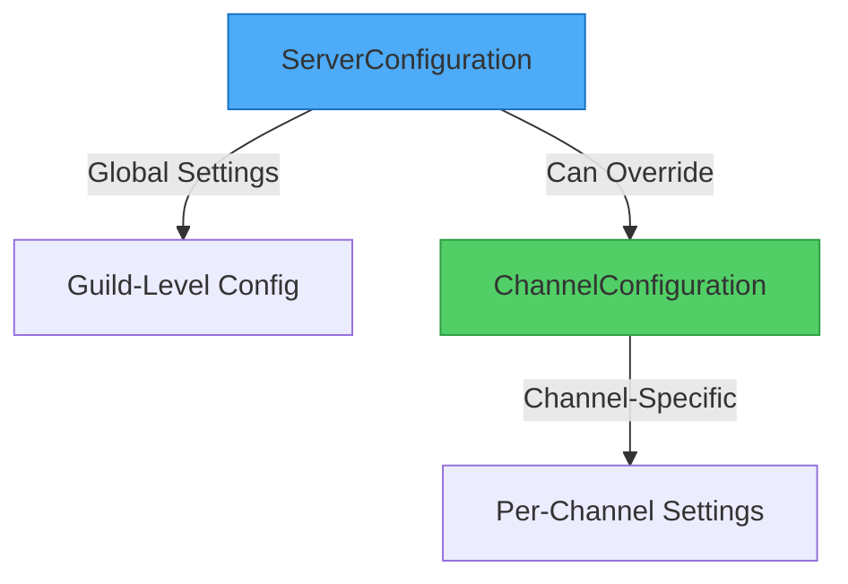
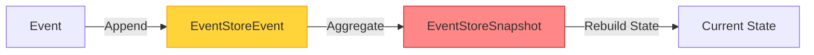
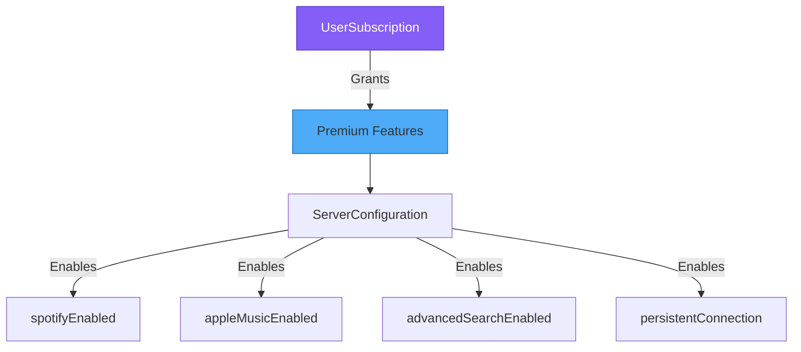

# Database Schema Architecture

## Overview
This diagram illustrates the PostgreSQL database schema using Prisma ORM. The schema supports music queuing, configuration management, premium features, and event sourcing.

## Entity Relationship Diagram

```mermaid
erDiagram
    GuildConfig ||--o{ FeatureFlag : has
    GuildConfig ||--o| ServerConfiguration : configures

    ServerConfiguration ||--o{ ChannelConfiguration : contains

    Queue ||--o{ QueueItem : contains

    UserProfile ||--o{ PlaybackHistory : generates
    UserProfile ||--o| UserSubscription : has

    AuditLog }o--|| GuildConfig : tracks

    EventStoreEvent ||--o| EventStoreSnapshot : snapshots

    WebhookSubscription }o--|| GuildConfig : subscribes

    GuildConfig {
        string id PK
        string guildId UK
        string prefix
        string language
        datetime createdAt
    }

    Queue {
        string id PK
        string guildId IDX
        string voiceChannelId IDX
        string textChannelId
        datetime createdAt IDX
    }

    QueueItem {
        string id PK
        string queueId FK
        string title
        string url IDX
        string requestedBy IDX
        int duration
        datetime createdAt IDX
    }

    UserProfile {
        string id PK
        string userId UK
        datetime createdAt
    }

    AuditLog {
        string id PK
        string guildId IDX
        string userId IDX
        string action
        datetime createdAt IDX
    }

    RateLimit {
        string id PK
        string key UK
        int count
        datetime expiresAt IDX
    }

    FeatureFlag {
        string id PK
        string guildId IDX
        string name IDX
        boolean enabled
    }

    ServerConfiguration {
        string id PK
        string guildId UK,FK
        string subscriptionTier IDX
        datetime subscriptionExpiresAt IDX
        boolean spotifyEnabled
        boolean appleMusicEnabled
        boolean deezerEnabled
        boolean lyricsEnabled
        boolean sponsorBlockEnabled
        boolean advancedSearchEnabled
        string maxAudioQuality
        int volumeLimit
        int maxQueueSize
        int maxSongDuration
        boolean allowExplicitContent
        string djRoleId
        boolean djOnlyMode
        boolean voteSkipEnabled
        float voteSkipThreshold
        boolean autoplayEnabled
        string autoplayMode
        int autoplayQueueSize
        boolean ephemeralMessages
        boolean persistentConnection
        datetime createdAt
        datetime updatedAt
    }

    ChannelConfiguration {
        string id PK
        string guildId FK,IDX
        string channelId IDX
        boolean musicEnabled
        boolean playlistsEnabled
        boolean spotifyEnabled
        boolean appleMusicEnabled
        boolean deezerEnabled
        boolean lyricsEnabled
        boolean sponsorBlockEnabled
        int volumeLimit
        int maxQueueSize
        int maxSongDuration
        boolean djOnlyMode
        boolean allowExplicitContent
        datetime createdAt
        datetime updatedAt
    }

    UserSubscription {
        string id PK
        string userId UK
        string tier IDX
        datetime expiresAt IDX
        string stripeCustomerId
        string stripeSubscriptionId
        string paymentMethod
        int monthlyPlayTime
        int monthlyRequests
        int premiumServers
        boolean customBotEnabled
        boolean prioritySupport
        datetime createdAt
        datetime updatedAt
    }

    LyricsCache {
        string id PK
        string trackId UK
        string title
        string artist
        string lyrics
        string source
        string language
        boolean timedLyrics
        string lyricsData
        datetime createdAt
        datetime expiresAt IDX
    }

    PlaybackHistory {
        string id PK
        string guildId IDX
        string userId IDX
        string channelId
        string title
        string artist
        string url
        int duration
        string source IDX
        datetime playedAt IDX
        boolean playedFully
        string skipReason
        string playbackQuality
        string[] pluginsUsed
    }

    EventStoreEvent {
        int id PK
        string eventId UK
        string eventType IDX
        string aggregateId
        string aggregateType
        int aggregateVersion
        string eventData
        string metadata
        datetime timestamp IDX
        datetime createdAt
        int globalPosition IDX
    }

    EventStoreSnapshot {
        int id PK
        string aggregateId
        string aggregateType UK
        int version
        string data
        datetime timestamp IDX
        datetime createdAt
    }

    WebhookSubscription {
        string id PK
        string guildId IDX,FK
        string webhookUrl
        string[] events
        boolean isActive IDX
        datetime createdAt
        datetime updatedAt
    }
```

## Schema Design Patterns

### 1. Configuration Hierarchy



**Inheritance Pattern:**
- Server configuration sets defaults for entire guild
- Channel configuration can override server settings with `null` values inheriting from server
- Enables fine-grained control per channel

### 2. Event Sourcing Pattern



**Purpose:**
- Full audit trail of all system events
- Point-in-time state reconstruction
- Snapshots optimize query performance
- Supports analytics and debugging

### 3. Premium Feature Model



## Key Tables

### Core Music Functionality

**Queue & QueueItem**
- Manages per-guild music queues
- Tracks song requests and order
- Links to voice and text channels
- Supports queue persistence across restarts

**PlaybackHistory**
- Analytics for track plays
- Skip reason tracking
- Quality metrics
- Plugin usage statistics

### Configuration Management

**ServerConfiguration**
- Premium tier management
- Feature toggles (Spotify, Apple Music, Deezer, etc.)
- Audio quality settings
- Queue limitations
- Autoplay configuration
- DJ mode settings

**ChannelConfiguration**
- Channel-specific overrides
- Inheritance from server config (nullable fields)
- Music enablement per channel
- Fine-grained permission control

### Premium Features

**UserSubscription**
- User-level subscriptions (free, basic, premium, enterprise)
- Payment provider integration (Stripe, PayPal, crypto)
- Usage tracking (play time, requests)
- Premium server allocation

**LyricsCache**
- Cached lyrics from providers (Genius, Musixmatch)
- Timed lyrics support (LRC format)
- Expiration management
- Multi-language support

### Audit & Compliance

**AuditLog**
- User action tracking
- Guild activity monitoring
- Compliance and moderation support

**RateLimit**
- API rate limiting
- Search throttling
- Prevents abuse

**FeatureFlag**
- Feature rollout management
- A/B testing support
- Per-guild feature toggles

### Event Sourcing

**EventStoreEvent**
- Immutable event log
- Aggregate versioning
- Global position tracking
- Full event replay capability

**EventStoreSnapshot**
- Performance optimization
- Aggregate state caching
- Reduces event replay overhead

### Webhooks

**WebhookSubscription**
- External service integration
- Event notification system
- Per-guild webhook management
- Event type filtering

## Indexes

### Performance Optimization
- **guildId indexes** - Fast guild-scoped queries
- **Composite indexes** - `[guildId, createdAt]` for time-series queries
- **URL indexes** - Quick track deduplication
- **User indexes** - Efficient user analytics

### Query Patterns
```typescript
// Fast guild queue lookup
Queue.findMany({ where: { guildId }, orderBy: { createdAt: 'desc' } })

// Efficient playback history
PlaybackHistory.findMany({
  where: { guildId, playedAt: { gte: last30Days } },
  orderBy: { playedAt: 'desc' }
})

// Premium feature check
ServerConfiguration.findUnique({ where: { guildId } })
```

## Data Relationships

### One-to-Many
- Queue → QueueItems
- ServerConfiguration → ChannelConfigurations
- UserProfile → PlaybackHistory

### One-to-One
- GuildConfig → ServerConfiguration
- UserProfile → UserSubscription

### Many-to-Many
- Implemented via arrays (`FeatureFlag.events`, `PlaybackHistory.pluginsUsed`)

## Cascade Deletion
- **ChannelConfiguration** - Cascade delete when ServerConfiguration is deleted
- Ensures referential integrity
- Prevents orphaned records

## Migration Strategy
- Prisma migrations for schema changes
- Event store immutability preserved
- Backward-compatible changes preferred
- Data migration scripts for major changes
