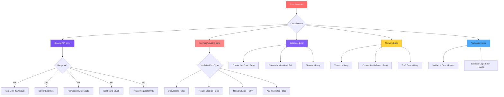
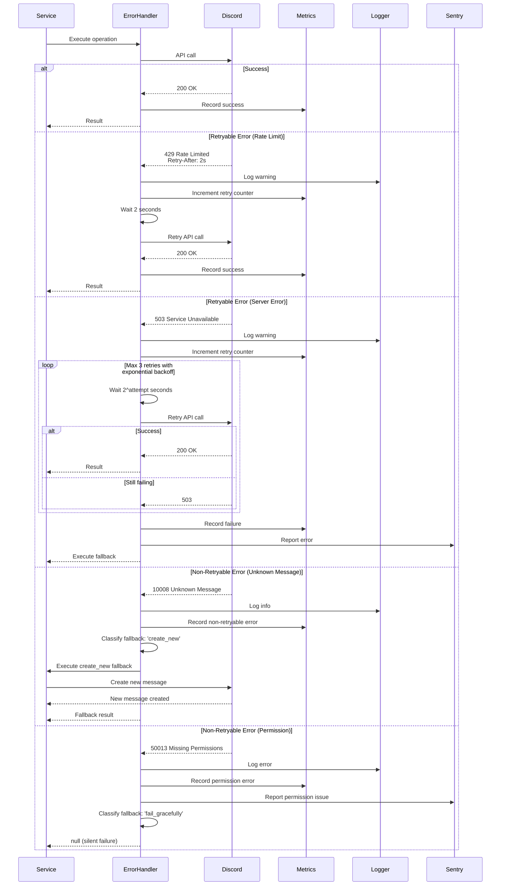
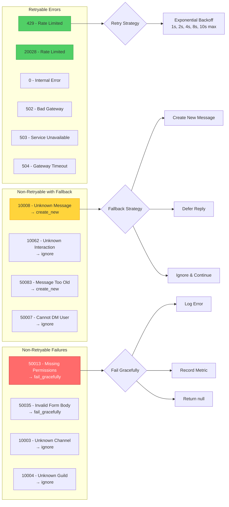
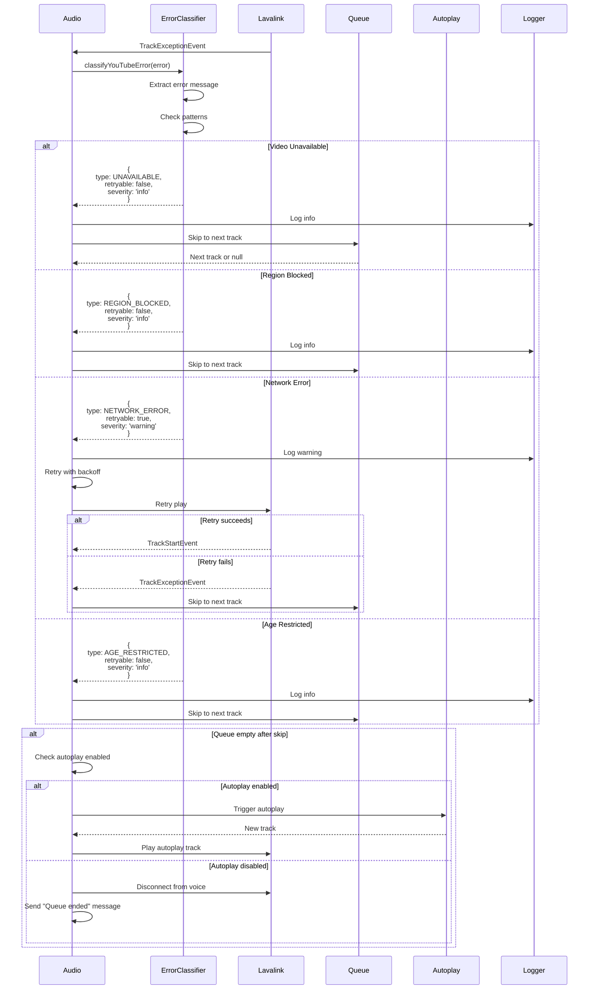
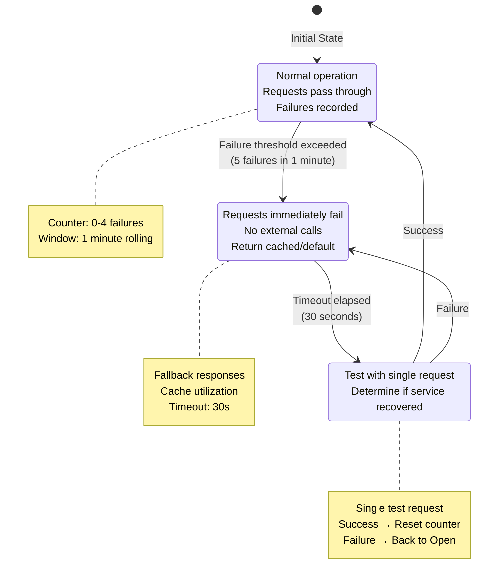
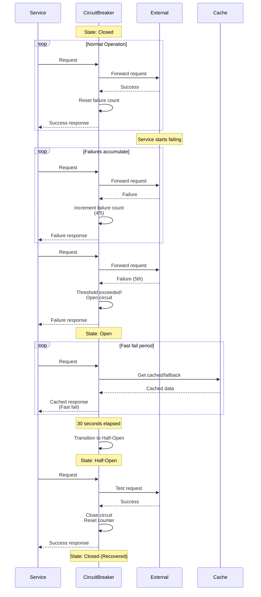
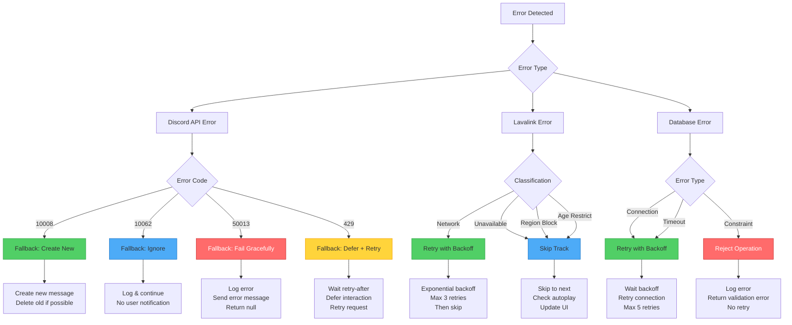
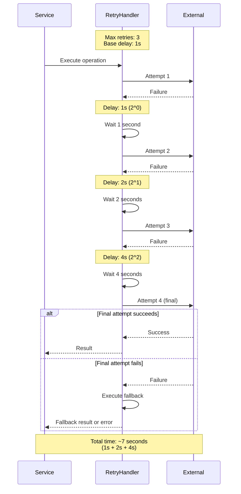
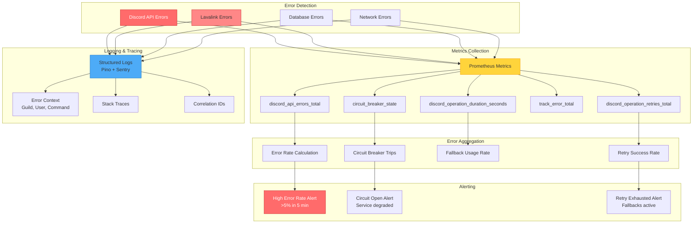

# Error Handling & Resilience Architecture

## Overview
This diagram illustrates the comprehensive error handling, retry logic, circuit breakers, and fallback strategies across all services. The system is designed for resilience and graceful degradation.

## Error Classification Hierarchy

## Discord API Error Handling Flow

## Discord Error Classification Matrix

## YouTube/Lavalink Error Handling

## Circuit Breaker Pattern

## Circuit Breaker Implementation

## Fallback Strategy Decision Tree

## Retry Strategy with Exponential Backoff

## Error Metrics and Monitoring

## Error Recovery Strategies

### 1. Graceful Degradation
**Principle:** System continues with reduced functionality
**Examples:**
- Search fails → Use cached results
- Lyrics unavailable → Show track info only
- Premium features disabled → Fall back to free tier

### 2. Silent Recovery
**Principle:** Automatic recovery without user notification
**Examples:**
- Message edit fails → Create new message
- Voice reconnection → Automatic rejoin
- Database retry → Transparent to user

### 3. User Notification
**Principle:** Inform user of issues they need to know
**Examples:**
- Permission errors → Request admin to grant permissions
- Track unavailable → Skip and notify
- Rate limit reached → Temporary cooldown message

### 4. Fail Fast
**Principle:** Quick failure for unrecoverable errors
**Examples:**
- Invalid configuration → Startup failure
- Missing credentials → Service won't start
- Constraint violations → Immediate rejection

## Error Handling Best Practices

### Do's
- Classify errors before handling
- Use structured logging with context
- Implement retry with exponential backoff
- Provide fallback strategies
- Monitor error rates and patterns
- Test error scenarios
- Document error responses

### Don'ts
- Swallow errors silently (log everything)
- Retry indefinitely (set max attempts)
- Block user experience (use timeouts)
- Expose internal errors to users
- Retry non-retryable errors
- Ignore error metrics
- Hard-code retry delays

## Observability Integration

### Sentry Error Tracking
- Automatic error capture
- Stack trace preservation
- User context (Guild ID, User ID)
- Breadcrumbs (command history)
- Performance monitoring

### Structured Logging (Pino)
- Error severity levels
- Contextual information
- Correlation IDs
- JSON format for parsing
- Log rotation and retention

### Prometheus Metrics
- Error counters by type
- Retry attempt histograms
- Operation duration
- Circuit breaker state
- Success/failure rates
