# Service Communication Architecture

## Overview
This diagram illustrates the Redis pub/sub communication channels between the Discord bot's microservices. The system uses asynchronous messaging for scalability and fault tolerance.

## Communication Flow Diagram

```mermaid
graph TB
    subgraph "Discord Platform"
        Discord[Discord API]
    end

    subgraph "Gateway Service :3001"
        GW[Gateway Service<br/>Discord.js v14]
        GW_CMD[Command Handler]
        GW_UI[UI Manager]
        GW_VOICE[Voice Event Handler]
    end

    subgraph "Audio Service :3002"
        AUDIO[Audio Service<br/>Lavalink Client]
        AUDIO_CMD[Command Processor]
        AUDIO_PLAY[Playback Manager]
        AUDIO_AUTO[Autoplay Engine]
    end

    subgraph "API Service :3000"
        API[REST API<br/>Express.js]
        API_HEALTH[Health Checks]
        API_METRICS[Metrics Endpoint]
    end

    subgraph "Worker Service :3003"
        WORKER[Worker Service<br/>BullMQ]
        WORKER_CLEAN[Cleanup Jobs]
        WORKER_STATS[Stats Aggregation]
    end

    subgraph "Redis Pub/Sub Channels"
        REDIS[(Redis :6379)]
        CH_CMD[discord-bot:commands<br/>Gateway → Audio]
        CH_TO_AUDIO[discord-bot:to-audio<br/>Voice Events & Discord Events]
        CH_TO_DISCORD[discord-bot:to-discord<br/>Lavalink Events]
        CH_UI_NOW[discord-bot:ui:now<br/>Real-time UI Updates]
    end

    subgraph "External Services"
        LAVALINK[Lavalink :2333<br/>Audio Processing]
        POSTGRES[(PostgreSQL :5432<br/>Persistent Storage)]
    end

    %% Discord connections
    Discord <-->|WebSocket Gateway| GW

    %% Gateway to Redis channels
    GW_CMD -->|Publish Commands| CH_CMD
    GW_VOICE -->|Publish Voice State<br/>VOICE_SERVER_UPDATE<br/>VOICE_STATE_UPDATE| CH_TO_AUDIO
    CH_TO_DISCORD -->|Subscribe| GW_UI
    CH_UI_NOW -->|Subscribe| GW_UI

    %% Audio to Redis channels
    CH_CMD -->|Subscribe| AUDIO_CMD
    CH_TO_AUDIO -->|Subscribe| AUDIO_PLAY
    AUDIO_PLAY -->|Publish Lavalink Events| CH_TO_DISCORD
    AUDIO_AUTO -->|Publish UI Updates| CH_UI_NOW

    %% Lavalink connections
    AUDIO <-->|WebSocket| LAVALINK

    %% Database connections
    GW -.->|Read/Write Config| POSTGRES
    AUDIO -.->|Queue Management| POSTGRES
    API -.->|Query Data| POSTGRES
    WORKER -.->|Cleanup & Stats| POSTGRES

    %% Redis queue connections
    WORKER <-.->|BullMQ Jobs| REDIS

    %% API connections
    API_HEALTH -.->|Check Services| GW
    API_HEALTH -.->|Check Services| AUDIO
    API_HEALTH -.->|Check Services| LAVALINK

    style REDIS fill:#ff6b6b,stroke:#c92a2a,color:#fff
    style CH_CMD fill:#51cf66,stroke:#2f9e44,color:#000
    style CH_TO_AUDIO fill:#51cf66,stroke:#2f9e44,color:#000
    style CH_TO_DISCORD fill:#51cf66,stroke:#2f9e44,color:#000
    style CH_UI_NOW fill:#51cf66,stroke:#2f9e44,color:#000
    style GW fill:#4dabf7,stroke:#1971c2,color:#000
    style AUDIO fill:#4dabf7,stroke:#1971c2,color:#000
    style API fill:#4dabf7,stroke:#1971c2,color:#000
    style WORKER fill:#4dabf7,stroke:#1971c2,color:#000
    style LAVALINK fill:#ffd43b,stroke:#f59f00,color:#000
    style POSTGRES fill:#845ef7,stroke:#5f3dc4,color:#fff
    style Discord fill:#7950f2,stroke:#5f3dc4,color:#fff
```



## Redis Pub/Sub Channels

### 1. discord-bot:commands
**Direction:** Gateway → Audio
**Purpose:** Command routing and execution requests
**Message Types:**
- Play commands (`/play`, `/playnext`, `/playnow`)
- Queue management (`skip`, `pause`, `resume`, `stop`)
- Playback control (`seek`, `volume`, `loop`)
- Queue operations (`shuffle`, `clear`)

**Message Format:**
```typescript
{
  type: 'play' | 'skip' | 'pause' | 'resume' | 'stop' | 'seek' | 'volume' | 'loop' | 'shuffle' | 'clear',
  guildId: string,
  userId: string,
  channelId: string,
  data: Record<string, any>,
  metadata: {
    timestamp: number,
    commandType?: 'play' | 'playnext' | 'playnow'
  }
}
```

### 2. discord-bot:to-audio
**Direction:** Gateway → Audio
**Purpose:** Discord voice events and state updates
**Message Types:**
- `VOICE_SERVER_UPDATE` - Critical for voice connection establishment
- `VOICE_STATE_UPDATE` - Voice state changes
- Discord client events forwarding

**Critical Fix (Sept 24, 2025):**
Raw voice events now forwarded to enable `player.connected = true`, resolving voice connection race conditions.

### 3. discord-bot:to-discord
**Direction:** Audio → Gateway
**Purpose:** Lavalink event propagation to Discord
**Message Types:**
- Track start/end events
- Player state changes
- Error notifications
- Queue state updates

### 4. discord-bot:ui:now
**Direction:** Audio → Gateway
**Purpose:** Real-time UI updates for music controls
**Message Types:**
- Now playing updates
- Queue changes
- Playback progress
- Button state updates

**UI Update Format:**
```typescript
{
  guildId: string,
  channelId: string,
  messageId?: string,
  action: 'create' | 'update' | 'delete',
  embed: DiscordEmbed,
  components: DiscordActionRow[]
}
```

## Communication Patterns

### Synchronous Operations
- **API Health Checks** - Direct HTTP calls to service health endpoints
- **Database Queries** - Direct PostgreSQL connections via Prisma
- **Lavalink Communication** - WebSocket for audio streaming

### Asynchronous Operations
- **Command Execution** - Pub/sub for decoupled command processing
- **UI Updates** - Pub/sub for real-time interface updates
- **Event Propagation** - Pub/sub for event-driven architecture

## Benefits

1. **Scalability** - Services can scale independently
2. **Fault Tolerance** - Message queue persistence during service restarts
3. **Loose Coupling** - Services don't need direct knowledge of each other
4. **Event Sourcing** - All events logged for debugging and analytics
5. **Real-time Updates** - Instant UI synchronization across channels

## Performance Considerations

- **Message Size** - Keep pub/sub messages under 1MB
- **Channel Isolation** - Separate channels prevent message flooding
- **Subscription Management** - Services only subscribe to relevant channels
- **Redis Persistence** - Messages persist during brief disconnections
