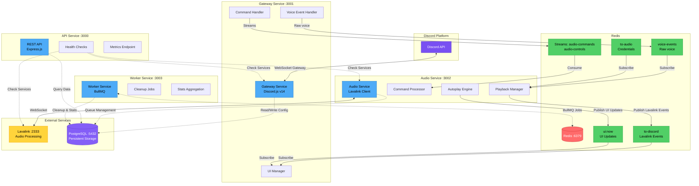

# Service Communication Architecture

## Overview
This diagram illustrates the Redis communication (Streams + Pub/Sub) between the Discord bot's microservices. Commands use Redis Streams; voice events and UI updates use Pub/Sub.

## Communication Flow Diagram


```mermaid
graph TB
    subgraph "Discord Platform"
        Discord[Discord API]
    end

    subgraph "Gateway Service :3001"
        GW[Gateway Service<br/>Discord.js v14]
        GW_CMD[Command Handler]
        GW_UI[UI Manager]
        GW_VOICE[Voice Event Handler]
    end

    subgraph "Audio Service :3002"
        AUDIO[Audio Service<br/>Lavalink Client]
        AUDIO_CMD[Command Processor]
        AUDIO_PLAY[Playback Manager]
        AUDIO_AUTO[Autoplay Engine]
    end

    subgraph "API Service :3000"
        API[REST API<br/>Express.js]
        API_HEALTH[Health Checks]
        API_METRICS[Metrics Endpoint]
    end

    subgraph "Worker Service :3003"
        WORKER[Worker Service<br/>BullMQ]
        WORKER_CLEAN[Cleanup Jobs]
        WORKER_STATS[Stats Aggregation]
    end

    subgraph "Redis"
        REDIS[(Redis :6379)]
        STREAMS[Streams: audio-commands<br/>audio-controls]
        CH_VOICE[voice-events<br/>Raw voice]
        CH_TO_AUDIO[to-audio<br/>Credentials]
        CH_TO_DISCORD[to-discord<br/>Lavalink Events]
        CH_UI_NOW[ui:now<br/>UI Updates]
    end

    subgraph "External Services"
        LAVALINK[Lavalink :2333<br/>Audio Processing]
        POSTGRES[(PostgreSQL :5432<br/>Persistent Storage)]
    end

    %% Discord connections
    Discord <-->|WebSocket Gateway| GW

    %% Gateway to Redis
    GW_CMD -->|Streams| STREAMS
    GW_VOICE -->|Raw voice| CH_VOICE
    CH_TO_DISCORD -->|Subscribe| GW_UI
    CH_UI_NOW -->|Subscribe| GW_UI

    %% Audio to Redis
    STREAMS -->|Consume| AUDIO_CMD
    CH_VOICE -->|Subscribe| AUDIO_PLAY
    CH_TO_AUDIO -->|Subscribe| AUDIO_PLAY
    AUDIO_PLAY -->|Publish Lavalink Events| CH_TO_DISCORD
    AUDIO_AUTO -->|Publish UI Updates| CH_UI_NOW

    %% Lavalink connections
    AUDIO <-->|WebSocket| LAVALINK

    %% Database connections
    GW -.->|Read/Write Config| POSTGRES
    AUDIO -.->|Queue Management| POSTGRES
    API -.->|Query Data| POSTGRES
    WORKER -.->|Cleanup & Stats| POSTGRES

    %% Redis queue connections
    WORKER <-.->|BullMQ Jobs| REDIS

    %% API connections
    API_HEALTH -.->|Check Services| GW
    API_HEALTH -.->|Check Services| AUDIO
    API_HEALTH -.->|Check Services| LAVALINK

    style REDIS fill:#ff6b6b,stroke:#c92a2a,color:#fff
    style STREAMS fill:#51cf66,stroke:#2f9e44,color:#000
    style CH_VOICE fill:#51cf66,stroke:#2f9e44,color:#000
    style CH_TO_AUDIO fill:#51cf66,stroke:#2f9e44,color:#000
    style CH_TO_DISCORD fill:#51cf66,stroke:#2f9e44,color:#000
    style CH_UI_NOW fill:#51cf66,stroke:#2f9e44,color:#000
    style GW fill:#4dabf7,stroke:#1971c2,color:#000
    style AUDIO fill:#4dabf7,stroke:#1971c2,color:#000
    style API fill:#4dabf7,stroke:#1971c2,color:#000
    style WORKER fill:#4dabf7,stroke:#1971c2,color:#000
    style LAVALINK fill:#ffd43b,stroke:#f59f00,color:#000
    style POSTGRES fill:#845ef7,stroke:#5f3dc4,color:#fff
    style Discord fill:#7950f2,stroke:#5f3dc4,color:#fff
```

## Redis Channels

### Redis Streams (canal principal)
- **discord-bot:audio-commands** — play, queue, shuffle, clear, stop, autoplay
- **discord-bot:audio-controls** — toggle, pause, resume, skip, volume, loop, mute
- **discord-bot:audio-responses** — respuestas síncronas (queue paginado)

### discord-bot:voice-events
**Direction:** Gateway → Audio
**Purpose:** Raw Discord gateway events para Lavalink (VOICE_STATE_UPDATE, VOICE_SERVER_UPDATE)

### discord-bot:to-audio
**Direction:** Gateway → Audio
**Purpose:** VOICE_CREDENTIALS estructurados, search, play (DiscordAudioService)

### discord-bot:to-discord
**Direction:** Audio → Gateway
**Purpose:** Lavalink event propagation to Discord
**Message Types:**
- Track start/end events
- Player state changes
- Error notifications
- Queue state updates

### discord-bot:ui:now
**Direction:** Audio → Gateway
**Purpose:** Real-time UI updates for music controls
**Message Types:**
- Now playing updates
- Queue changes
- Playback progress
- Button state updates

**UI Update Format:**
```typescript
{
  guildId: string,
  channelId: string,
  messageId?: string,
  action: 'create' | 'update' | 'delete',
  embed: DiscordEmbed,
  components: DiscordActionRow[]
}
```

## Communication Patterns

### Synchronous Operations
- **API Health Checks** - Direct HTTP calls to service health endpoints
- **Database Queries** - Direct PostgreSQL connections via Prisma
- **Lavalink Communication** - WebSocket for audio streaming

### Asynchronous Operations
- **Command Execution** - Pub/sub for decoupled command processing
- **UI Updates** - Pub/sub for real-time interface updates
- **Event Propagation** - Pub/sub for event-driven architecture

## Benefits

1. **Scalability** - Services can scale independently
2. **Fault Tolerance** - Message queue persistence during service restarts
3. **Loose Coupling** - Services don't need direct knowledge of each other
4. **Event Sourcing** - All events logged for debugging and analytics
5. **Real-time Updates** - Instant UI synchronization across channels

## Performance Considerations

- **Message Size** - Keep pub/sub messages under 1MB
- **Channel Isolation** - Separate channels prevent message flooding
- **Subscription Management** - Services only subscribe to relevant channels
- **Redis Persistence** - Messages persist during brief disconnections
